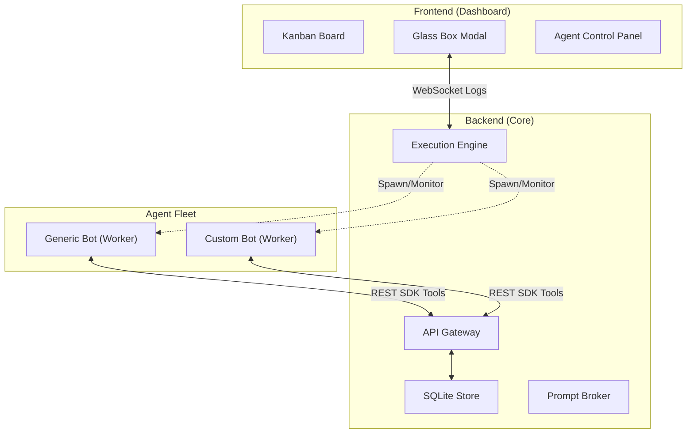

# Aegis 4.0: Autonomous Multi-Agent OS & Orchestration Hub

Aegis is a high-performance Kanban-based orchestration hub designed to manage, monitor, and interact with teams of autonomous AI agents. Unlike traditional automation platforms, Aegis treats AI agents as a managed fleet of contributors, providing unified discovery, "Glass Box" real-time observability, and a robust REST SDK for agent-to-board interaction.

---

## 🚀 Core Features

- 🤖 **Autonomous Sandbox Bots** — Workers operate on a persistent ReAct loop, self-assigning tasks and using LLM tool calling to interact with the board.
- 📋 **Dynamic Board Architecture** — Fully customizable Kanban workflows. Add or remove columns to fit your specific pipeline needs, and agents will adapt.
- 🏗️ **Smart Agent Registry** — Bootstrap workers instantly from a registry. Aegis automatically handles local scaffolding and dependency management.
- 🖥️ **Glass Box Control Panel** — Real-time observability. See live terminal logs, inject context into stdin, or pause/resume agent processes.
- 📡 **Live Activity Monitoring** — Real-time indicators showing exactly what an agent is doing (Thinking, Processing, Acting) via WebSockets.
- ⚙️ **Dynamic Goal Tuning** — Change agent goals on the fly. Update an agent's objective while paused and resume work without a rebuild.
- 🚦 **Prompt Broker** — Centralized rate-limiting and token estimation ensuring your team respects API quotas (OpenAI, Anthropic, Gemini, DeepSeek).
- 🔑 **Streamlined Onboarding** — Auto-detection for providers (sk-ant, AIza, sk-) and dynamic model fetching.
- 🌍 **Cross-Platform Stability** — Full UTF-8/Unicode support for Windows and Linux environments.

---

## 🏗️ Architecture

Aegis uses a decentralized execution model where agents interact with the core orchestrator as if it were a local OS service.

---

## 🤖 Autonomous Sandbox Bots

Aegis 4.0 shifts from specialized scripts to **Fully Autonomous Sandbox Bots** powered by a "Natural API" toolset.

### The ReAct Loop

Agents operate on a continuous loop governed by a configurable `pulse_interval`:

1. **Observe**: Fetch full board state (`/api/cards`) and column configuration (`/api/columns`).
2. **Reason**: Evaluate current board state against high-level goals.
3. **Act**: Select a tool (action) and execute it via the REST API.
4. **Sleep**: Wait for the next pulse.

### "Natural" API Capabilities

Bots aren't just consumers; they are first-class citizens with full authority to manage the board:

- **Card Management**: Create, Update, and **Delete** cards as needed.
- **Workflow Management**: Create and Delete **Columns** to dynamically restructure the Kanban board.
- **Context Richness**: Bots parse card comments, priorities, and dependency chains to make informed decisions.
- **Proactive Communication**: Reasoning is logged as comments, providing a "paper trail" for autonomous actions.

---

## 📡 REST API (Agent SDK)

Agents interact with Aegis primarily through a simple REST API.

| Endpoint | Method | Description |
| :--- | :--- | :--- |
| `/api/cards` | `GET` | List all cards on the board. |
| `/api/cards` | `POST` | Create a new card. |
| `/api/cards/{id}` | `PATCH` | Update card (move column, change assignee, etc). |
| `/api/cards/{id}` | `DELETE` | Remove a card from the board. |
| `/api/columns` | `GET` | Get current column structure. |
| `/api/columns` | `POST` | Create a new Kanban column. |
| `/api/columns/{id}` | `DELETE` | Remove a column. |
| `/api/instances` | `GET` | List active agent instances. |

---

## 🛠️ Getting Started

1. **Bootstrap**: Run `setup.bat` (Windows) or `setup.sh` (POSIX) to create your virtual environment.
2. **Registry Sync**: Run `python setup_templates.py` to generate the local template scaffolds for all bots in the registry.
3. **Launch**: Start the server with `python main.py` and navigate to `http://localhost:8080`.
4. **Define Workflows**: Use the "+ Add Column" button to structure your board (e.g., "Inbox", "In Review", "Done").
5. **Instantiate**: Create a worker from the sidebar, give it a specific goal (e.g., "Process all items in Inbox"), and watch it work!

---

## 🔒 Security & RBAC

- **Provider Isolation**: API keys are injected only into the process environment of the specific worker.
- **Protocol Guard**: All board updates originating from agents are validated against active instance IDs and required headers.
- **Execution Sandbox**: Future support for Docker-based execution ensures agents can run untrusted code without host risk.

---

Built with ❤️ for the next generation of autonomous development.

## Changelog
- 2026-02-27: Auto-improvement run

