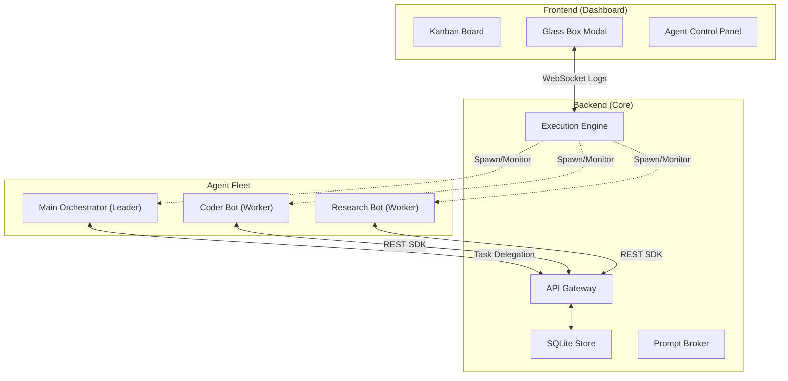

# Aegis 4.0: Autonomous Multi-Agent OS & Orchestration Hub

Aegis is a high-performance Kanban-based orchestration hub designed to manage, monitor, and interact with teams of autonomous AI agents. Aegis treats AI agents as a managed fleet of contributors, providing unified discovery, "Glass Box" real-time observability, and a robust REST SDK for agent-to-board interaction.

---

## 🚀 Core Features

- 👑 **Main Orchestrator** — A mandatory, auto-instantiated manager that acts as the brain of the operation, delegating complex tasks to specialized workers.
- 🤖 **Autonomous Daemons** — Workers operate on a persistent `while True` loop, self-assigning tasks from the Inbox and scanning repositories for context.
- 📋 **DAG-Based Kanban** — Industry-standard task management with built-in support for Directed Acyclic Graph (DAG) task dependencies.
- 🏗️ **Smart Agent Registry** — Bootstrap workers instantly from a registry. Aegis automatically handles local scaffolding and dependency management.
- 🖥️ **Glass Box Control Panel** — Real-time observability. See live terminal logs, inject context into stdin, or pause/resume agent processes.
- 🚦 **Prompt Broker** — Centralized rate-limiting and token estimation ensuring your team respects API quotas (OpenAI, Anthropic, Gemini).
- 🔑 **Streamlined Onboarding** — Auto-detection for providers (sk-ant, AIza, sk-) and dynamic model fetching.

---

## 🏗️ Architecture

Aegis uses a decentralized execution model where agents interact with the core orchestrator as if it were a local OS service.

---

## 👑 The Main Orchestrator

The **Aegis Orchestrator** is the central commander of your agent fleet. It is automatically created upon first launch and cannot be deleted.

- **Solo Mode**: If the Orchestrator is the only active agent, it functions as a standard autonomous worker, picking up and executing tasks directly.
- **Manager Mode**: If other specialized agents are available, the Orchestrator uses its LLM (GPT-4o-mini/Haiku recommended) to break down parent cards into sub-tasks, assigning them to the most appropriate workers via the board.

---

## 🤖 Autonomous Daemons

Aegis 4.0 shifts from "one-off scripts" to **True Autonomous Daemons**.

1. **The Pulse**: Agents poll the board every $N$ seconds (Pulse Interval).
2. **Self-Assignment**: If an agent sees an unassigned card in the "Inbox" that matches its capabilities, it self-assigns and moves it to "In Progress".
3. **Workspace Scanning**: Agents use their `work_dir` to index the local repository before execution, ensuring they have the latest code context.
4. **Live Documentation**: Agents post progress updates as comments on the card and generate local `work_log.md` artifacts.

---

## 🛠️ Getting Started

1. **Bootstrap**: Run `setup.bat` (Windows) or `setup.sh` (POSIX).
2. **Setup Registry**: Run `python setup_templates.py` to generate the local template scaffolds.
3. **Launch**: `python main.py` and navigate to `http://localhost:8080`.
4. **Configure the Brain**: Look for the **Main Orchestrator** in the sidebar. provide it with an API key to enable Manager Mode.
5. **Drop a Task**: Create a card in the **Inbox**. Watch as the Orchestrator picks it up, breaks it down, and delegates it to your workers!

---

## 🔒 Security & RBAC

- **Provider Isolation**: API keys are injected only into the process environment of the specific worker.
- **Protocol Guard**: All board updates originating from agents are validated against active instance IDs and required headers.

---

Built with ❤️ for the next generation of autonomous development.
