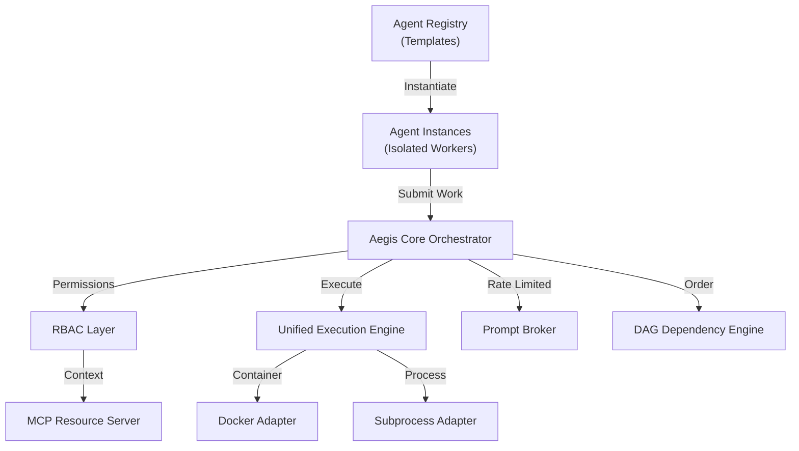

# Aegis 2.0: Multi-Agent Kanban & Orchestration Hub

Aegis is a high-performance Kanban-based orchestration hub for autonomous AI agents. It transforms your development workflow by treating AI agents as a managed team of contributors, complete with protocol-level discovery, DAG workflows, and factory-pattern agent instancing.

---

## 🚀 Core Features

- 📋 **DAG-Based Kanban** — Industry-standard task management with built-in support for complex task dependencies (DAGs).
- 🏗️ **Agent Factory** — Instantiate multiple isolated workers from base agent templates (OpenClaw, PicoClaw, etc.).
- 🚦 **Prompt Broker** — Centralized rate-limiting and token estimation ensuring adherence to API quotas.
- 🛡️ **Unified Execution Engine** — Managed agent runtimes using isolated Docker containers or subprocesses with unique working directories per instance.
- 🔒 **RBAC for MCP** — Fine-grained permission system (read/write/git) for agents accessing project resources via Model Context Protocol.
- 📺 **Real-Time Observability** — Live log streaming via WebSockets and real-time dashboard updates.

---

## 🏗️ Architecture

---

## 🛠️ Getting Started

1. **Setup**: Run `setup.bat` (Windows) or `setup.sh` (Mac/Linux).
2. **Install Templates**: Go to **🏪 Marketplace**, browse the registry, and click **Install**. 
3. **Create Workers**: Click **+ Create** in the sidebar to spawn a new instance (e.g., "Frontend-Coder") from an installed template.
4. **DAG Workflows**: Open a card detail to link tasks. Use `parent_ids` to ensure tasks are only started when their dependencies are `Done`.

---

## 🏗️ The Agent Factory

Aegis uses a **Factory Pattern** for agent management:
- **Templates**: Read-only base code for an agent (cloned from GitHub). Located in `aegis_data/templates/`.
- **Instances**: Isolated working copies spawned from templates. Each instance has its own `cwd` and configuration. Located in `aegis_data/instances/`.

This allows you to have multiple distinct workers (e.g., a "Vue-Specialist" and a "Python-Guru") running from the same base OpenClaw code simultaneously.

---

## ⛓️ DAG Workflows & Task Dependencies

Cards in Aegis are not just flat tasks. They can form complex **Directed Acyclic Graphs (DAGs)**:
- Set `parent_ids` on a card to create a dependency.
- The orchestrator automatically holds cards in the `Inbox` until all parents are `Done`.
- Use the **Review** column as a human-in-the-loop gate before dependent tasks begin.

---

## 🔒 Security & RBAC

Agents access your workspace via the **MCP (Model Context Protocol)** server. Aegis enforces **Role-Based Access Control (RBAC)**:
- Define `permissions` in `agent_registry.json` (e.g., `read_workspace`, `write_workspace`, `git_commit`).
- The MCP server validates the `x-aegis-agent` header on every tool call.
- Agents cannot perform unauthorized file or system operations.

---

## ⚙️ Configuration

Managed via `aegis.config.json`. Key parameters:
- `polling_rate_ms`: Frequency of the orchestrator loop.
- `max_concurrent_agents`: System-wide cap on active processes.
- `mcp.workspaces`: List of directories exposed to the agents.

---

Built with ❤️ for the next generation of autonomous development.
