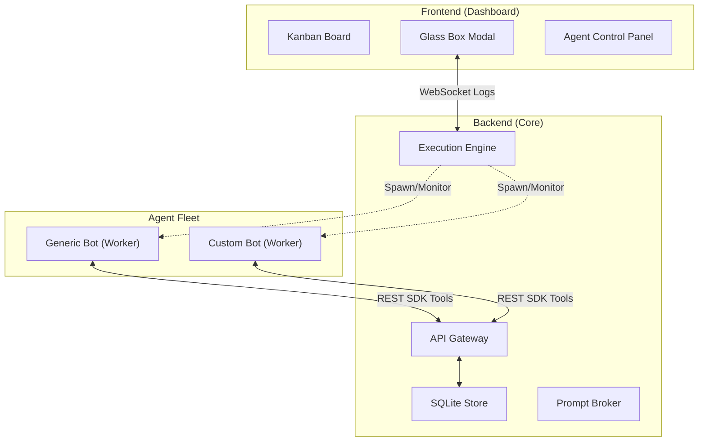

# Aegis 4.0: Autonomous Multi-Agent OS & Orchestration Hub

Aegis is a high-performance Kanban-based orchestration hub designed to manage, monitor, and interact with teams of autonomous AI agents. Aegis treats AI agents as a managed fleet of contributors, providing unified discovery, "Glass Box" real-time observability, and a robust REST SDK for agent-to-board interaction.

---

## 🚀 Core Features

- 🤖 **Autonomous Sandbox Bots** — Workers operate on a persistent ReAct loop, self-assigning tasks and using LLM tool calling to interact with the board.
- 📋 **Dynamic Board Architecture** — Fully customizable Kanban workflows. Add or remove columns to fit your specific pipeline needs, and agents will adapt.
- 🏗️ **Smart Agent Registry** — Bootstrap workers instantly from a registry. Aegis automatically handles local scaffolding and dependency management.
- 🖥️ **Glass Box Control Panel** — Real-time observability. See live terminal logs, inject context into stdin, or pause/resume agent processes.
- 🚦 **Prompt Broker** — Centralized rate-limiting and token estimation ensuring your team respects API quotas (OpenAI, Anthropic, Gemini).
- 🔑 **Streamlined Onboarding** — Auto-detection for providers (sk-ant, AIza, sk-) and dynamic model fetching.

---

## 🏗️ Architecture

Aegis uses a decentralized execution model where agents interact with the core orchestrator as if it were a local OS service.

---

## 🤖 Autonomous Sandbox Bots

Aegis 4.0 shifts from specialized scripts to **Fully Autonomous Sandbox Bots**.

1. **The ReAct Loop**: Agents poll the board every $N$ seconds (Pulse Interval), fetching all cards and the current custom column state.
2. **Tool-Driven Execution**: By passing the board state and the user-defined `AEGIS_CONFIG_GOALS` to an LLM, the agent decides its next action.
3. **Board Manipulation**: Agents can execute tools to create new cards, update existing cards across columns, or post comments.
4. **Resiliency**: If no tools are needed or the agent is blocked, it seamlessly enters a waiting state until the next pulse.

---

## 🛠️ Getting Started

1. **Bootstrap**: Run `setup.bat` (Windows) or `setup.sh` (POSIX).
2. **Setup Registry**: Run `python setup_templates.py` to generate the local template scaffolds.
3. **Launch**: `python main.py` and navigate to `http://localhost:8080`.
4. **Define Workflows**: Use the "+ Add Column" button to structure your board.
5. **Drop a Task**: Create a worker, give it an API key and an arbitrary goal, and drop a task in its intended start column!

---

## 🔒 Security & RBAC

- **Provider Isolation**: API keys are injected only into the process environment of the specific worker.
- **Protocol Guard**: All board updates originating from agents are validated against active instance IDs and required headers.

---

Built with ❤️ for the next generation of autonomous development.
