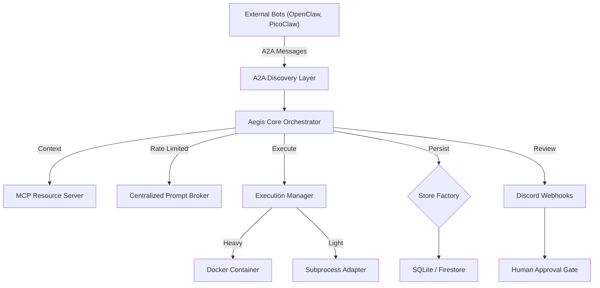

# Aegis 2.0: Multi-Agent Kanban & Orchestration Hub

Aegis is a high-performance Kanban-based orchestration hub for autonomous AI agents. It transforms your development workflow by treating AI agents as a managed team of contributors, complete with protocol-level discovery, rate-limited execution, and human-in-the-loop validation.

---

## 🚀 Core Features

- 📋 **Protocol-Native Kanban** — Industry-standard task management with built-in A2A (Agent-to-Agent) and MCP (Model Context Protocol) support.
- 🏪 **Agent Marketplace** — Discover, install, and manage third-party bots from a centralized registry.
- 🚦 **Prompt Broker** — Centralized rate-limiting (1 prompt/min) ensuring strict adherence to API quotas and budget constraints.
- 🛡️ **Execution Manager** — Sandboxed agent runtimes using Docker or isolated subprocesses with full lifecycle monitoring.
- 🔒 **HITL Validation** — Hardened state-transition validation; agents can propose work, but only humans can approve it to "Done".
- 📺 **Real-Time Observability** — Live terminal log streaming via WebSockets and real-time board updates.

---

## 🏗️ Architecture



---

## 🛠️ Getting Started

### Quick Start (Windows)
1. Double-clck `setup.bat`.
2. Wait for the environment to initialize.
3. Access the dashboard at `http://localhost:8080`.

### Quick Start (Mac/Linux)
1. `chmod +x setup.sh && ./setup.sh`
2. Access the dashboard at `http://localhost:8080`.

---

## 🔌 Protocol Support

### A2A (Agent-to-Agent)
Aegis implements an AgentCard discovery endpoint at `/.well-known/agent.json`. External bots can register tasks directly into the Inbox via the A2A ingestion endpoint.

### MCP (Model Context Protocol)
Aegis acts as an MCP Resource Server, exposing project workspaces, file systems, and tools to connected LLMs in a standardized, discoverable format.

---

## 🏪 Agent Marketplace

Manage your AI workforce directly from the dashboard:
1. Click **🏪 Marketplace** in the header.
2. Browse the **Registry** for available bots (OpenClaw, PicoClaw, Gemini CLI, etc.).
3. Click **Install** to clone and configure the bot automatically.
4. Monitor **Active Runtimes** to see live PIDs, memory usage, and streaming logs.

---

## ⚙️ Configuration

Aegis is highly configurable via `aegis.config.json`:

```json
{
  "orchestration_mode": "supervisor",
  "polling_rate_ms": 5000,
  "max_concurrent_agents": 4,
  "rate_limits": {
    "prompts_per_minute": 1,
    "max_retries_on_fail": 3
  },
  "discord": {
    "webhook_url": "YOUR_WEBHOOK_URL",
    "notify_on_review": true
  },
  "mcp": {
    "workspaces": ["./src", "./docs"]
  }
}
```

---

## 🛡️ Human-in-the-Loop

Aegis enforces a strict security boundary:
- **Agents** can move cards to `Review`.
- **Humans** must click `✓ Approve & Complete` to move a card to `Done`.
- **Validation** prevents agents from bypassing this gate via API.

---

Built with ❤️ for the next generation of autonomous development.
