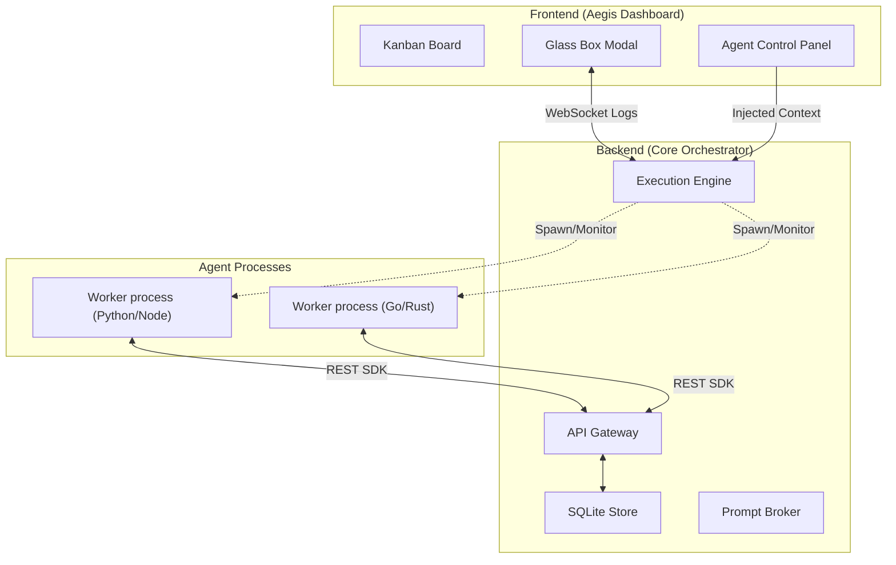

# Aegis 4.0: Autonomous Multi-Agent OS & Orchestration Hub

Aegis is a high-performance Kanban-based orchestration hub designed to manage, monitor, and interact with teams of autonomous AI agents. Aegis treats AI agents as a managed fleet of contributors, providing unified discovery, "Glass Box" real-time observability, and a robust REST SDK for agent-to-board interaction.

---

## 🚀 Core Features

- 📋 **DAG-Based Kanban** — Industry-standard task management with built-in support for Directed Acyclic Graph (DAG) task dependencies.
- 🏗️ **Smart Agent Registry** — Bootstrap workers instantly from a registry of "Agent Types". Aegis automatically handles local scaffolding and dependency management.
- 🖥️ **Glass Box Control Panel** — Real-time observability into agent internals. See live terminal logs, inject context into stdin, or pause/resume agent processes.
- 🚦 **Prompt Broker** — Centralized rate-limiting and token estimation ensuring your team respects API quotas (OpenAI, Anthropic, Gemini supported).
- 🔑 **Streamlined Onboarding** — Single API key field with auto-detection for providers (sk-ant, AIza, sk-). Models are dynamically fetched and revealed only after key verification.
- 🎯 **Worker-Level Goals** — Move beyond global planners. Every worker is instantiated with a specific set of goals and instructions defined in their configuration.

---

## 🏗️ Architecture

Aegis uses a decentralized execution model where agents interact with the core orchestrator as if it were a local OS service.



---

## 🛠️ Getting Started

1. **Bootstrap**: Run `setup.bat` (Windows) or `setup.sh` (POSIX).
2. **Setup Registry**: Run `python setup_templates.py` to generate the local template scaffolds for all Agent Types.
3. **Launch**: `python main.py` and navigate to `http://localhost:8080`.
4. **Create a Worker**:
    - Click **+ Create** in the Sidebar.
    - Select an **Agent Type** (e.g., PicoClaw).
    - Paste your **API Key**. Aegis will detect the service (e.g., Anthropic) and reveal the **Model** selection.
    - Define the **Agent Goals** (e.g., "Implement the login logic using JWT").
5. **Assign Tasks**: Move a card to the `In Review` or `Doing` column and assign it to your new worker.

---

## 📦 The Agent Forge & local Scaffolding

Aegis handles agent installation differently than standard orchestration tools.

- **Agent Types**: Pre-defined configurations in `agent_registry.json`.
- **Templates**: To ensure stability, Aegis uses a **Local Scaffolding** system. Templates are maintained in `aegis_data/templates/` and copied to `aegis_data/instances/` upon creation.
- **Isolated CWD**: Every worker instance has its own unique working directory, preventing resource conflicts.

---

## ⛓️ Agent SDK (Board Interaction)

Agents are not "black boxes". They are provided with an **Execution Context** via Environment Variables:

- `AEGIS_API_URL`: The base URL of the orchestrator API.
- `AEGIS_CARD_ID`: The ID of the task currently assigned to the agent.
- `AEGIS_CONFIG_GOALS`: The worker-specific goal instructions.

### Example Interaction Pattern

Agents can natively "see" and "move" cards on the board using simple HTTP requests:

```python
import os, requests

# 1. Fetch task details
api = os.environ["AEGIS_API_URL"]
card_id = os.environ["AEGIS_CARD_ID"]
card = requests.get(f"{api}/cards/{card_id}").json()

# 2. Perform work...
print(f"Working on: {card['title']}")

# 3. Move to 'Review' column when finished
requests.patch(f"{api}/cards/{card_id}", json={"column": "Review"})
```

---

## 🔒 Security & RBAC

- **Provider Isolation**: API keys are injected only into the process environment of the specific worker.
- **Protocol Guard**: All board updates originating from agents are validated against active instance IDs and required headers.

---

Built with ❤️ for the next generation of autonomous development.
